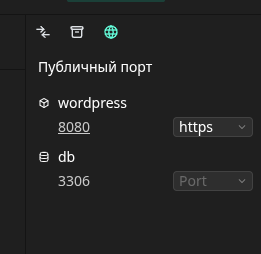
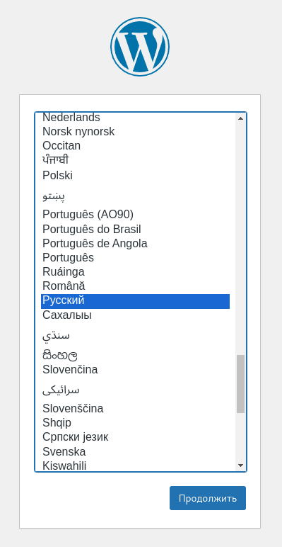
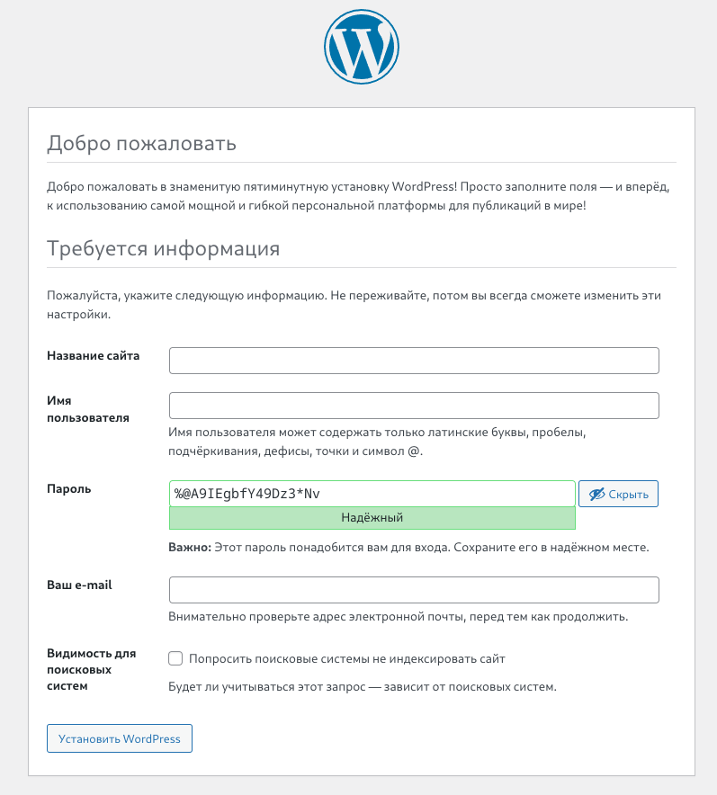
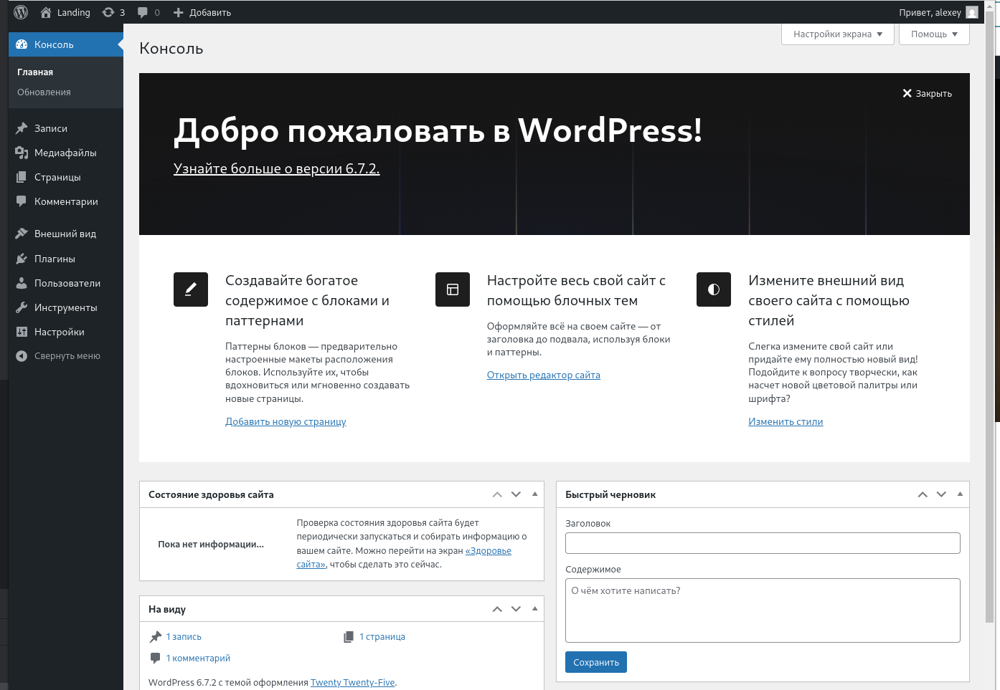
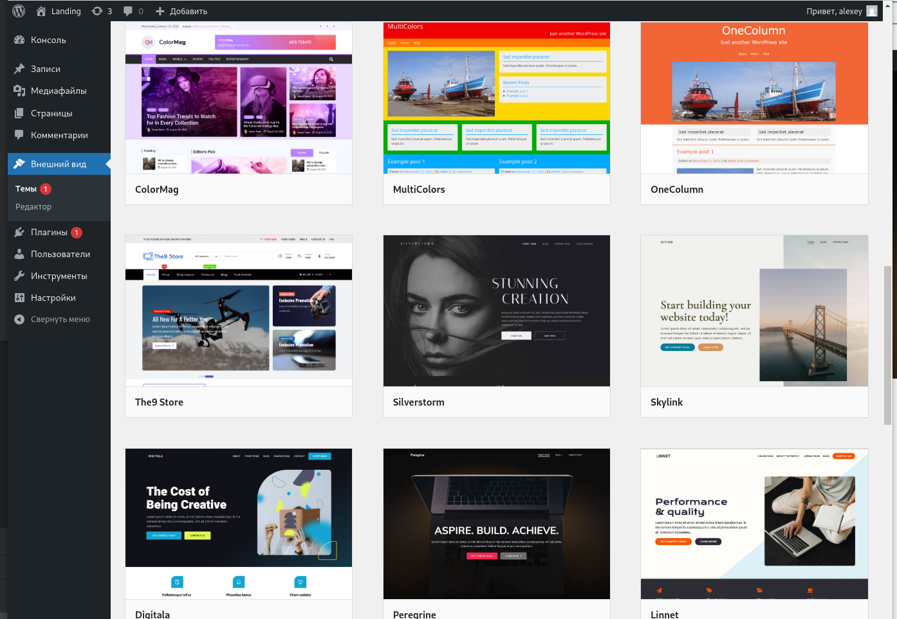
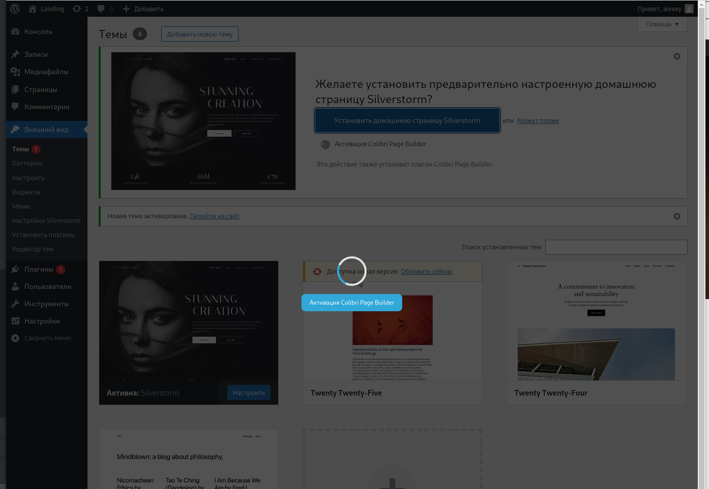
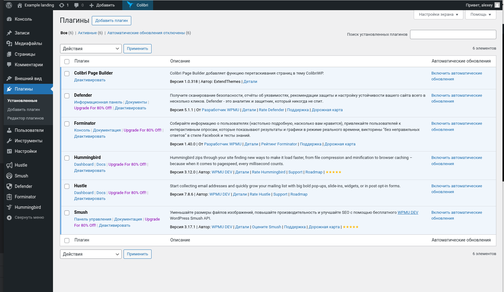
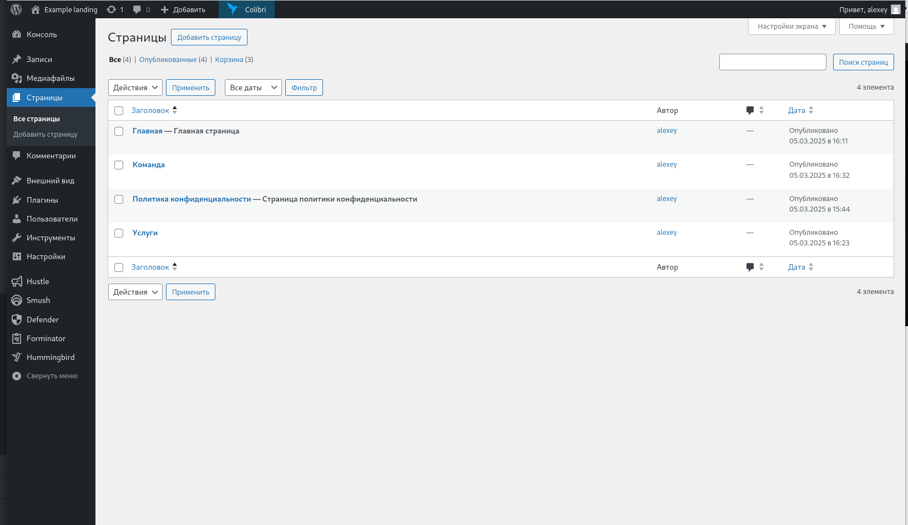
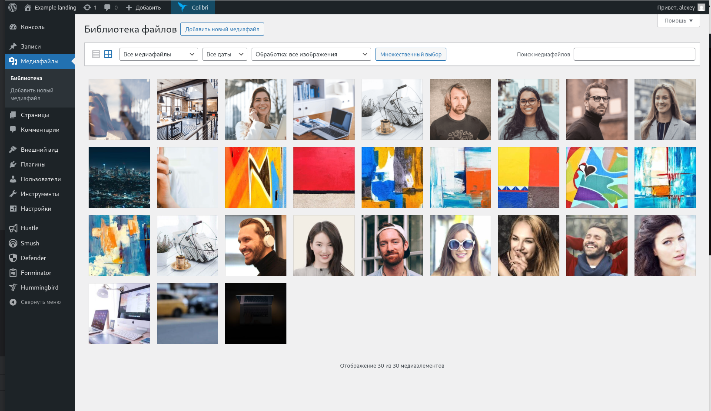

### -------------------------------------------------------------------
### Ссылка на шаблон на платформе L1veStack
> [Шаблон WordPress на L1veStack](https://console.l1vestack.ru/template/wordpress)

### -------------------------------------------------------------------

# Быстрый запуск сайта на WordPress с L1veStack

Если вам нужен сайт оперативно, вы можете запустить его буквально за несколько часов, используя готовый шаблон WordPress на платформе L1veStack.

## Шаги для создания сайта

### 1. Разворачиваем WordPress на L1veStack

- Открываем шаблон WordPress на платформе L1veStack.
- Нажимаем кнопку **«Скопировать себе»**, чтобы создать копию проекта.
- Выбираем порт для WordPress (кнопка **“Port”**).
- Запускаем проект (кнопка **“Запустить”**).
- Платформа выдаст ссылку на порту 8080 — переходим по ней в браузере.

### 2. Устанавливаем WordPress

- В появившемся окне выбираем **русский язык**.

- Заполняем основные данные для установки (название сайта, логин, пароль, email).

- Завершаем установку и заходим в **админ-панель WordPress**.

### 3. Настраиваем внешний вид

- Переходим во вкладку **«Внешний вид» → «Темы»**.

- Добавляем новую тему (можно выбрать из стандартных или загрузить свою).

- Устанавливаем и активируем тему.

- При необходимости настраиваем тему через **«Кастомайзер»**.

### 4. Настраиваем редактор страниц

- Устанавливаем и активируем **Colibri Page Builder** (или другой удобный конструктор, например, **Elementor**).
- Настраиваем макет страниц, выбираем шрифты, цвета и размещаем блоки.
- Добавляем нужные плагины для расширения функционала (например, **SEO, формы, галереи**).

### 5. Добавляем контент

- Переходим во вкладку **«Страницы»** и создаем новые страницы (*Главная, О нас, Контакты* и т. д.).

- В разделе **«Меню»** настраиваем навигацию.
- Загружаем изображения в **медиатеку** (раздел **«Медиафайлы»**).

- Добавляем тексты, фотографии, видео.

🎉 **Готово!**

Вы получили адаптивный сайт, который корректно отображается как на мобильных устройствах, так и на десктопах.

---

## Дополнительные возможности WordPress

WordPress предлагает множество бесплатных и платных плагинов, позволяющих создать полноценный сайт без программирования.

С помощью готовых шаблонов и плагинов можно:

✅ **Добавить формы обратной связи**  
✅ **Настроить SEO-оптимизацию**  
✅ **Подключить интернет-магазин (WooCommerce)**  
✅ **Встроить онлайн-чат и CRM**  
✅ **Автоматизировать рассылки**

🚀 Если вам нужен сайт быстро, **WordPress + L1veStack** — отличное решение!
